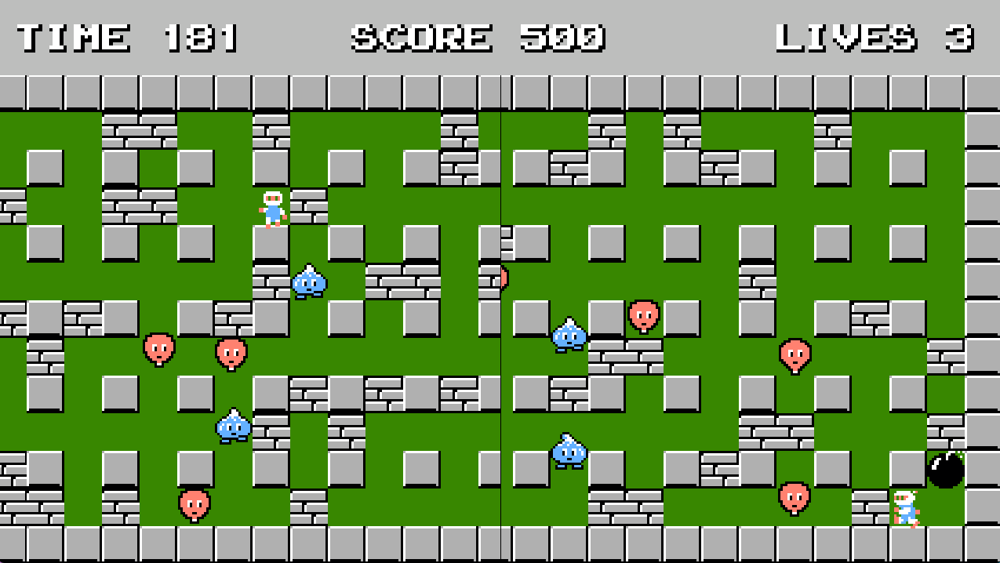

**Bomberman**

In this recreation of Bomberman made with C++, you can play together or alone.  
Each stage gets progressively harder, what stage can you get to?

---

#### Features

- Local Multiplayer w/ Splitscreen
- Each stage gets progressively harder until you inevitably lose
- Main Menu
- Next Stage Transition
- Background Music and SFX

---

#### Controls

**Player 1**  
Movement: WASD  
Placing Bomb: X

**Player 2**  
Movement: Arrow Keys  
Placing Bomb: Spacebar

---

#### Credits

Everything except for template and miniaudio.h is created by Kevin Pladdet

Template is created and provided by Jacco Bikker

---

#### Dependencies

miniaudio.h can be downloaded at https://miniaud.io/